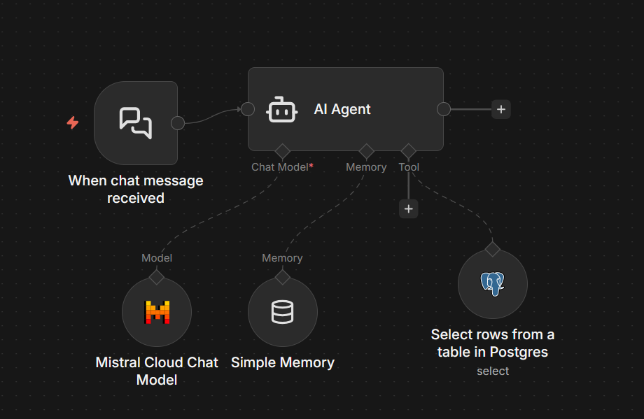

<h1 align="center"><span style="color: #DC143C;">🩸 <b>BloodSIM</b> - <span style="color: #8B0000;">Blood Inventory Simulation System</span></span></h1>

<p align="center">
  
  
  
</p>

<p align="center"><i>A Python-based blood inventory management and simulation system that tracks blood availability across multiple hospitals and generates PDF reports at regular intervals.</i></p>

---

## 📊 <span style="color: #FF4500;">**Overview**</span>

<p style="color: #2F4F4F;">BloodSIM simulates blood inventory updates based on <b>popularity weights</b> and generates automated reports. The system connects to a PostgreSQL database to store and manage blood stock levels for <span style="color: #FF6347;">three hospitals (A, B, and C)</span>.</p>

---

## 📁 <span style="color: #FF4500;">**Project Structure**</span>

```plaintext
BloodSIM/
├── BloodIO.py         # Blood inventory operations (add, remove, reset)
├── compostFuncs.py    # Common PostgreSQL database utilities
├── config.py          # Configuration settings and constants
├── postquery.py       # SQL schema and initial data
├── repoGEN.py         # PDF report generator
├── testcone.py        # Database connection test
├── reports/           # Generated PDF reports
└── venv/              # Virtual environment
```

---

## ⚙️ <span style="color: #FF4500;">**Prerequisites**</span>

<ul>
  <li><span style="color: #4169E1;">🐍 <b>Python 3.x</b></span></li>
  <li><span style="color: #4169E1;">🗄️ <b>PostgreSQL database</b></span></li>
  <li><span style="color: #4169E1;">📦 <b>Required packages:</b></span>
    <ul>
      <li><code>psycopg2</code> - PostgreSQL adapter</li>
      <li><code>reportlab</code> - PDF generation</li>
    </ul>
  </li>
</ul>

---

## 🗄️ <span style="color: #FF4500;">**Database Setup**</span>

<ol>
  <li>Create a PostgreSQL database</li>
  <li>Run the SQL commands from <code>postquery.py</code>:
    <ul>
      <li>Create the <code>blood_availability</code> table</li>
      <li>Insert initial blood inventory data</li>
    </ul>
  </li>
  <li>Update credentials in <code>config.py</code>:</li>
</ol>

```python
host = "localhost"
port = "5432"
db = "postgres"
user = "postgres"
paw = "your_password"
```

---

## 🔧 <span style="color: #FF4500;">**Configuration**</span>

<p style="color: #2F4F4F;">Edit <code>config.py</code> to customize:</p>

<ul>
  <li><span style="color: #228B22;">📛 <b>Database credentials</b></span>: Connection parameters</li>
  <li><span style="color: #228B22;">🩸 <b>Blood groups</b></span>: List of tracked blood types</li>
  <li><span style="color: #228B22;">📈 <b>Popularity weights</b></span>: Determines how much blood gets added per update cycle</li>
  <li><span style="color: #228B22;">📋 <b>Table headers</b></span>: Display names for reports</li>
</ul>

---

## 🚀 <span style="color: #FF4500;">**Usage**</span>

### ✅ <span style="color: #32CD32;">**Test Database Connection**</span>

```bash
python testcone.py
```

### ▶️ <span style="color: #32CD32;">**Run Simulation and Generate Reports**</span>

```bash
python repoGEN.py
```

<p style="color: #2F4F4F;"><b>This will:</b></p>

<ol>
  <li>🔄 Reset blood data to initial values</li>
  <li>🔄 Run 5 update cycles with simulated inventory changes</li>
  <li>📄 Generate a PDF report after each cycle</li>
  <li>📁 Reports are saved in <code>reports/report_of_YYYY-MM-DD/</code></li>
</ol>

### 💻 <span style="color: #32CD32;">**Available Operations (BloodIO.py)**</span>

<ul>
  <li><code>add_popularity()</code> - Add inventory based on blood type popularity</li>
  <li><code>remove_random()</code> - Simulate random blood consumption</li>
  <li><code>dontbeNegative()</code> - Ensure no negative inventory values</li>
  <li><code>reset_blood_data()</code> - Reset to initial default values</li>
</ul>

---

## 🩸 <span style="color: #FF4500;">**Blood Types Tracked**</span>

| <span style="color: #DC143C;">Blood Group</span> | <span style="color: #DC143C;">Hospital A</span> | <span style="color: #DC143C;">Hospital B</span> | <span style="color: #DC143C;">Hospital C</span> |
|:---:|:---:|:---:|:---:|
| <span style="color: #FF0000;">**O+**</span> | <span style="color: #228B22;">120</span> | <span style="color: #228B22;">140</span> | <span style="color: #228B22;">100</span> |
| <span style="color: #FF0000;">**O-**</span> | <span style="color: #228B22;">50</span> | <span style="color: #228B22;">45</span> | <span style="color: #228B22;">45</span> |
| <span style="color: #FF0000;">**A+**</span> | <span style="color: #228B22;">90</span> | <span style="color: #228B22;">110</span> | <span style="color: #228B22;">80</span> |
| <span style="color: #FF0000;">**A-**</span> | <span style="color: #228B22;">25</span> | <span style="color: #228B22;">30</span> | <span style="color: #228B22;">25</span> |
| <span style="color: #FF0000;">**B+**</span> | <span style="color: #228B22;">30</span> | <span style="color: #228B22;">25</span> | <span style="color: #228B22;">25</span> |
| <span style="color: #FF0000;">**B-**</span> | <span style="color: #228B22;">10</span> | <span style="color: #228B22;">12</span> | <span style="color: #228B22;">8</span> |
| <span style="color: #FF0000;">**AB+**</span> | <span style="color: #228B22;">8</span> | <span style="color: #228B22;">6</span> | <span style="color: #228B22;">6</span> |
| <span style="color: #FF0000;">**AB-**</span> | <span style="color: #228B22;">3</span> | <span style="color: #228B22;">4</span> | <span style="color: #228B22;">3</span> |

---

## 📈 <span style="color: #FF4500;">**Popularity Weights**</span>

<p style="color: #2F4F4F;"><i>Higher weights indicate more demand and result in larger inventory additions:</i></p>

<ul>
  <li><span style="color: #FF6347;">🔴 <b>O+</b></span>: <span style="color: #FF4500;">1.5</span> <span style="color: #DC143C;">(highest demand)</span></li>
  <li><span style="color: #FF6347;">🟠 <b>A+</b></span>: <span style="color: #FF4500;">1.3</span></li>
  <li><span style="color: #FF6347;">🟡 <b>O-</b></span>: <span style="color: #FF4500;">1.2</span></li>
  <li><span style="color: #FF6347;">🟢 <b>A-</b></span>: <span style="color: #FF4500;">1.1</span></li>
  <li><span style="color: #FF6347;">🔵 <b>B+</b></span>: <span style="color: #FF4500;">1.0</span></li>
  <li><span style="color: #FF6347;">🟣 <b>B-</b></span>: <span style="color: #FF4500;">0.9</span></li>
  <li><span style="color: #FF6347;">⚪ <b>AB+</b></span>: <span style="color: #FF4500;">0.7</span></li>
  <li><span style="color: #FF6347;">⚫ <b>AB-</b></span>: <span style="color: #FF4500;">0.5</span> <span style="color: #4169E1;">(lowest demand)</span></li>
</ul>

---

## 🤖 <span style="color: #FF4500;">**n8n Chatbot Integration**</span>

<p align="center">
  
</p>

<p style="color: #2F4F4F;"><b>BloodSIM includes an n8n chatbot workflow</b> that allows users to query blood availability through a conversational interface.</p>

### ✨ <span style="color: #9370DB;">**Chatbot Features**</span>

<ul>
  <li><span style="color: #FF00FF;">🤖 <b>AI-powered conversations</b></span>: Uses Mistral Cloud Chat Model (Ministral-3b)</li>
  <li><span style="color: #FF00FF;">🗄️ <b>Database integration</b></span>: Directly queries the PostgreSQL <code>blood_availability</code> table</li>
  <li><span style="color: #FF00FF;">🧠 <b>Memory</b></span>: Maintains conversation context using buffer memory</li>
  <li><span style="color: #FF00FF;">💬 <b>Interactive</b></span>: Users can ask about blood stock levels for any hospital</li>
</ul>

### 🛠️ <span style="color: #9370DB;">**Setup**</span>

<ol>
  <li>Import the workflow file <code>workflows/chatbotn8n.json</code> into your n8n instance</li>
  <li>Configure the following credentials in n8n:
    <ul>
      <li><b>Postgres account</b>: Connection to your BloodSIM database</li>
      <li><b>Mistral Cloud account</b>: API credentials for the AI model</li>
    </ul>
  </li>
  <li>Activate the workflow</li>
  <li>Access the chatbot via the webhook URL generated by n8n (format: <code>https://your-n8n-instance.com/webhook/af5659fd-1971-449e-8191-64b14096711e</code>)</li>
</ol>

### 💬 <span style="color: #9370DB;">**Usage**</span>

<p style="color: #2F4F4F;"><i>Send chat messages to query blood availability, for example:</i></p>

<ul>
  <li>💬 "What is the O+ blood stock in Hospital A?"</li>
  <li>💬 "Do you have AB- blood available?"</li>
  <li>💬 "Show me all blood types in Hospital B"</li>
</ul>

<p align="center"><span style="color: #228B22;">✨ The chatbot will query the database and respond with current inventory levels! ✨</span></p>

---
